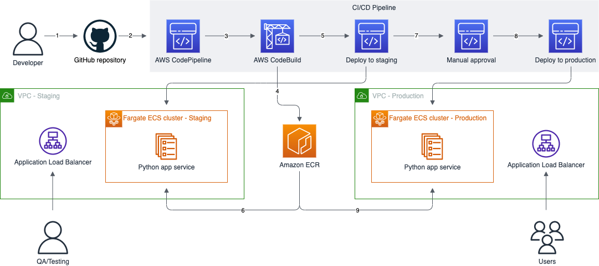

# Scaffold - Python ECS service and CI/CD pipeline in AWS

A complete CDK project for deploying an end-to-end CI/CD pipeline and infrastructure for a Python web service in AWS.

## Table of Contents

- [Overview](#overview)
    - [Architecture](#architecture)
- [Getting Started](#getting-started)
    - [Prerequisites](#prerequisites)
    - [Configuring](#onfiguring)
    - [Integrating you python application](#integrating-you-python-application)
    - [Deploying](#deploying)

## Overview
The goal of this project is to provide a ready-to-use deployment of a CI/CD pipeline in AWS that can be used to build, test and deploy a Python web service to a staging and production environment. It follows best practices outlined in the [AWS Well-Architected Framework](https://docs.aws.amazon.com/wellarchitected/latest/framework/welcome.html) and can be used as-is or customized to fit your needs.

### Architecture
<a href="https://github.com/vlttnv/scaffold/blob/master/documentation/scaffold.png"></a>

Workflow:
1. Code is pushed to the GitHub repository
2. The GitHub hook triggers the CodePipeline pipeline
3. CodePipeline starts the CodeBuild project which runs the tests, linters and builds the docker image
4. The built docker image is pushed to the ECR repository
5. CodePipeline triggers and ECS Deploy action for Staging
6. ECS pulls the new image and updates the services in the staging cluster
7. After testing in the stating environment the pipeline is now ready to continue when the Manual approval step is approved
8. CodePipeline triggers and ECS Deploy action for Production
9. ECS pulls the new image and updates the services in the production cluster


<!-- ### Deployed resources -->

## Getting Started

These instructions will guide you through deploying the pipeline and your application to a region in your AWS account.

### Prerequisites

You will need the following to deploy the CDK app:
- [AWS CLI](https://docs.aws.amazon.com/cli/latest/userguide/cli-chap-getting-started.html) installed and configured with your AWS account and region
- [AWS CDK v2](https://docs.aws.amazon.com/cdk/v2/guide/getting_started.html) installed and [bootstrapped](https://docs.aws.amazon.com/cdk/v2/guide/getting_started.html) for the account and region you are deploying to
- Grant AWS access to GitHub using an access token:

    - Create a [GitHub access token](https://docs.github.com/en/authentication/keeping-your-account-and-data-secure/creating-a-personal-access-token) with scope `repo` and `admin:repo_hook`
    - A [Secrets Manager Secret](https://docs.aws.amazon.com/secretsmanager/latest/userguide/managing-secrets.html) with the value of the access token

### Configuring
The CDK app can be configured by modifying `cdk.context.json`, more specifically the variables inside the `scaffold_config` property.  

| Property           | Comment                                                                                            |
|--------------------|----------------------------------------------------------------------------------------------------|
| app_name           | The name of your application. Used to name various AWS resources                                   |
| github_secret_name | The name of the Secrets Manager secret you created to store your GitHub access token               |
| prod_enabled       | If set to `true` deploy infrastructure for the production environment and add pipeline steps       |
| source             | The location of the CDK app and Python app repository that will be used as source for the pipeline |
| cidr               | The IPv4 CIDR block for the staging and production VPCs                                            |
| max_azs            | Maximum number of availability zones in each VPC. Minimum is 2                                     |
| nat_gateways       | Number of NAT gateways in each VPC                                                                 |
| desired_count      | Desired number of running instances of your service in the ECS cluster                             |

### Integrating you python application
The project comes with a sample dockerized Python application located in `app/`. Dependencies are located in `requirements.txt` and the `Dockerfile` describes how to build and image.

To integrate your app replace the source code inside `app/`, modify the `requirements.txt` file withe new dependencies and adjust the `Dockerfile` accordingly.

> Note: Currently your application must run on port 80 inside the container and the Dockerfile should expose port 80 as well

### Deploying

After completing the prerequisite steps and configuring the CDK app you are ready to deploy.

To deploy the CDK app run:

```
cdk deploy PipelineStack
```

This will deploy the pipeline infrastructure, staging environment infrastructure, and production environment infrastructure, if enabled. After deployment completes the pipeline will be trigger with the source code of your application and your application deployed.

If you enable the production environment at a later stage you can deploy it using the `cdk deploy PipelineStack` command.
